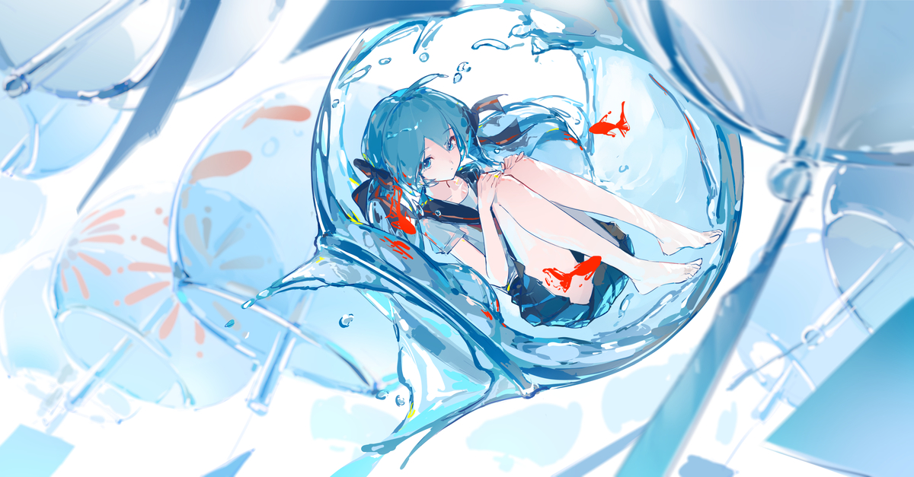

<div align="center">

<!-- 1. 顶部打字机特效 -->


<br/>

<!-- 2. 头像区域 (加大尺寸 + 圆形裁剪 + 蓝色光晕) -->
<!-- ⚠️ 重要提示：如果图片还是裂开，请把仓库里的文件名 "水中少女.jpg" 重命名为 "avatar.jpg" -->


<h2>👋 你好，我是 jnwjannajw</h2>
<p><b>现代 C++ 爱好者 | ACG 情人 | 开源探索器</b></p>

<!-- 3. 社交链接区 (采用图标矩阵，整齐排列) -->
<p>
<a href="https://github.com/jnwjannajw"></a>
<a href="https://www.zhihu.com/people/jnwjannajw"></a>
<a href="https://www.youtube.com/@jnwjannajw"></a>
<a href="https://learn.microsoft.com/zh-cn/users/jnwjannajw/"></a>
</p>

</div>

---

### 💻 核心重构日志

```cpp
// System Initialization...
// Loading Assets: Anime_Lover.dll, Cpp_Master.lib

class Jnwjannajw : public Human, public Otaku {
public:
string name = "jnwjannajw";
string role = "Modern C++ Alchemist"; // 现代C++炼金术士

// 核心技能树
void skills() {
cout << ">> Compiling with Visual Studio..." << endl;
cout << ">> Linking to ACG World..." << endl;
cout << ">> Status: Cheerful & Learning" << endl;
}

// 隐藏属性
bool isWaifuLover = true;
int caffeineLevel = 100; // 咖啡因含量
};

int main() {
Jnwjannajw me;
me.skills();
return 0; // Never stop coding
}
